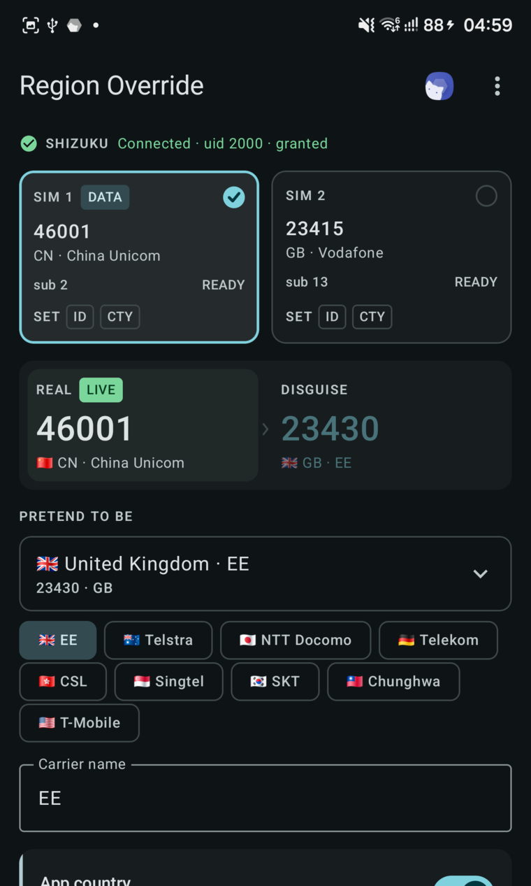

# Samsung Region Override

[简体中文](README.zh-CN.md) | English

Temporarily changes the SIM region that Android reports to region-sensitive apps. It is designed for
short sessions: start a disguise, open the Samsung or other target app, then end the disguise and
restore mobile service.

The primary target is recent Samsung firmware. The complete path has been tested on an **SM-S938B,
Android 16, One UI 8.5** with Shizuku 13.1.5. Other Samsung and non-Samsung builds are compatibility
targets, not validated claims.

No root is required. The radio remains attached to the real carrier and the phone number does not
change, but Android's carrier identity, CarrierConfig, data profiles and IMS behaviour can change. Do
not treat this as a harmless cosmetic switch.

<p align="center">
  
</p>

## The 60-second workflow

1. Start Shizuku and grant this app access.
2. Select the SIM, target region and the layers the target app needs.
3. Tap **Start disguise** and wait for the result.
4. Open and use the target app.
5. Return here, or use the ongoing notification, and tap **End & restore**.
6. Confirm mobile service is back. If IMS is still unavailable, toggle that SIM off and on in Settings
   or reboot.

Turning a layer switch off only excludes it from the next apply. It does **not** remove an already-live
layer; Restore does that. While a disguise is live, Restore becomes the primary bottom-bar action and
the notification keeps a one-tap **Restore now** shortcut available.

## The two layers

| UI layer | Android mechanism | Typical readers | Main trade-off |
|---|---|---|---|
| **SIM operator / Network** | `ITelephony.setCarrierTestOverride` | Galaxy Store and Samsung apps | A fake MCC/MNC can make a later IMS registration use the wrong carrier domain and fail |
| **App country / Country** | `CarrierConfigManager.overrideConfig` | TikTok and other apps that read the SIM ISO | Reloads CarrierConfig and can trigger the reconnect that exposes a live fake Network identity |

The Network layer writes MCC/MNC, a synthetic test IMSI, SPN and PNN. ICCID, GID, APN and carrier
privilege rules remain null. The Country layer writes `sim_country_iso_override_string` and can
optionally override the subscription display name.

Apps read the SIM that carries mobile data, and only that one. On a dual-SIM phone a disguise written
to the idle slot applies cleanly, reports success, and changes nothing any app can see — the override
really did land, and every field this tool reads back agrees it did. The SIM selector marks the data
slot **DATA** and says so plainly when the selected SIM is not it. Switch which SIM carries data in
Android Settings, not here.

App behaviour is not guaranteed by a single signal. Account country, IP address, CSC, app version,
server-side experiments and cached data can also participate. The UI force-stops selected target apps
after apply and restore so they can re-read the framework state on their next launch.

## Calls, IMS and recovery

The key finding is narrower than “both switches break calls”:

- The fake **Network MCC/MNC is the latent identity problem**.
- The **Country CarrierConfig reload is a common reconnect trigger**, not the fake identity itself.
- Network-only can preserve the old IMS session and appear healthy. It may still fail later after signal
  loss, airplane mode, a SIM/UICC cycle, a CarrierConfig refresh or another IMS reconnect.
- An 8-second `isImsRegistered(subId)` observation reports only the current state. It is not a promise
  about the next reconnect.

On the tested China Unicom SIM, Samsung IMS kept the China Unicom profile and APN but derived
`ims.mnc030.mcc234.3gppnetwork.org` from the fake EE MCC/MNC. The network returned SIP `403
Forbidden`. Restoring the real identity before cycling UICC applications returned IMS registration.

The current restore path therefore:

1. restores Network first when it was live;
2. warms the real country cache and waits for the final CarrierConfig clear to settle;
3. never cycles UICC while a known fake Network identity may remain;
4. restores the captured subscription display name;
5. cycles UICC only when IMS is down and Network is known real;
6. waits for IMS registration and reports an unconfirmed recovery as a warning, not a success.

See [the IMS investigation](docs/ims-investigation.md) for the reproduced sequences and AOSP paths.

## Recovery safeguards

- Real MCC/MNC, operator name, country ISO and display name are captured before the first layer, even
  when only one layer is selected. This prevents Network-first from saving a fake country as “real”.
- A synchronous pending journal is written immediately before privileged writes. If a process dies
  after Android changes but before the long report returns, the next launch still errs toward Restore.
- Snapshots are bound to a one-way SIM/card fingerprint when the firmware exposes one. A recycled
  `subId` is not allowed to write an old SIM's snapshot onto a replacement card. The raw ICCID never
  leaves the shell service.
- Target apps used during the live session are remembered per subscription. Restore stops the union of
  the original session list and the current list, even if the picker changed in between.
- All core overrides are transient. A reboot is the definitive reset, although a carrier display-name
  side effect may still need the captured-name restore.

## Requirements

- Android 10 (API 29) or newer.
- A recent Samsung phone is the supported focus; other Android implementations are experimental.
- Shizuku 13+, running as shell or root and granted to this app.
- A valid subscription. The Network layer additionally needs the SIM in `READY` state.

The app requests notification permission only when a disguise first becomes live. Refusing it does not
block operations; it removes the persistent reminder and Restore shortcut.

## Languages

The UI ships in English, Simplified Chinese, Traditional Chinese, Japanese, Korean, French, German,
Spanish, Brazilian Portuguese, Russian, Turkish, Arabic, Indonesian, Thai and Vietnamese. Android 13+
lists them under the system's per-app language settings; the overflow menu opens that page. Older
Android releases follow the system language.

Technical Binder/instrumentation reports remain in English so stable machine markers and bug reports do
not change with the UI locale.

## Target apps

The default list is user-editable:

| Package | App |
|---|---|
| `com.sec.android.app.samsungapps` | Galaxy Store |
| `com.samsung.android.voc` | Samsung Members |
| `com.zhiliaoapp.musically` | TikTok |

The on-demand panel can force-stop an app, optionally clear cache or all app data, and relaunch it.
Clearing **Data** signs the user out and removes downloads, drafts and local settings. Cache-only clear
is a documented timeout/no-op on the tested One UI build and is reported honestly.

## Build and test

Download the signed APK from [GitHub Releases](https://github.com/Ritel-T/SamsungRegionOverride/releases).
Each release publishes the APK SHA-256 and signing-certificate SHA-256; verify both before installing.

JDK 17 or newer is required. The wrapper pins Gradle 9.7.1 and AGP 9.3.1 supplies Kotlin 2.2.10.
Shizuku 13.1.5 AARs are vendored and checksum-pinned under `app/libs`.

```bash
./gradlew :app:testDebugUnitTest :app:assembleDebug
```

Debug APK:

```text
app/build/outputs/apk/debug/app-debug.apk
```

Maintainers can build the signed release variant using the environment-variable workflow documented in
[docs/RELEASING.md](docs/RELEASING.md). Signing material must remain outside the repository.

The test suite covers the two known Samsung/AOSP UICC toggle signatures, refuses unknown overloads,
guards against UICC recovery while a fake Network remains live, and verifies Network-first country
snapshot derivation.

## Architecture

1. Compose runs in `:ui` and keeps a minimal default-process instrumentation host bound.
2. Shizuku starts `CarrierOverrideUserService` as uid 2000.
3. The Network layer reflects the runtime `ITelephony` signature rather than hard-coding a Binder
   transaction number.
4. Samsung rejects direct shell CarrierConfig writes on the tested firmware, so a short-lived
   instrumentation adopts shell phone-state permissions under the app package identity.
5. Every asynchronous CarrierConfig write is bounded and reports whether the reload broadcast arrived.

`RuntimeProbe` remains available for device-specific signature and IMS diagnostics. Do not publish raw
`dumpsys` or logcat output without reviewing it for phone identifiers.

`sim-fingerprint SUB_ID` prints only the locally used SHA-256 prefix, never the raw ICCID.

## Privacy and scope

The app has no Internet permission, telemetry or account system. It operates locally through Shizuku.
It does not provide carrier entitlements, paid content or network access. Use it only on devices and
accounts you control, and follow the target service's terms and local law.

Samsung, Galaxy Store, Samsung Members, TikTok/ByteDance, Google and Shizuku do not sponsor or endorse
this project.

## Known limits

- Only SM-S938B / Android 16 / One UI 8.5 has been validated end to end.
- The current selector displays up to two active consumer-phone subscriptions.
- Presets are convenience data, not a live carrier database. Only EE / `23430` / `gb` has been applied
  and restored end to end on the reference device.
- A firmware that hides the card identifier marks new snapshots as unverified. If an identifier later
  becomes readable, the app refuses to attach it automatically to those old snapshots; reboot clears
  core overrides, after which app storage must be cleared before a new session.
- Some applications may continue to use account, IP or cached region after both layers change.

## License

[MIT](LICENSE). Vendored Shizuku libraries retain their Apache-2.0 license; see
[third-party notices](THIRD_PARTY_NOTICES.md).
