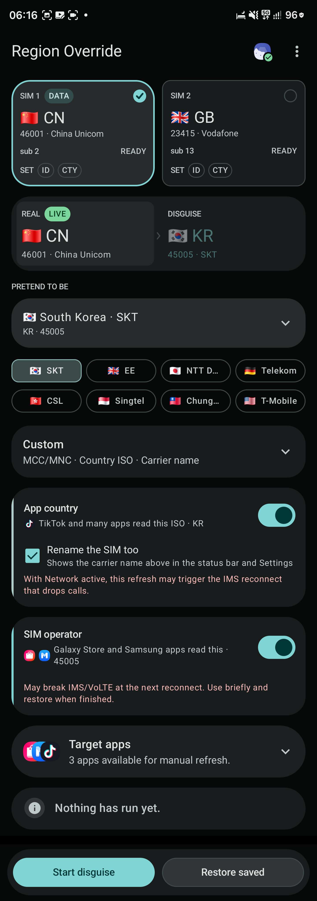
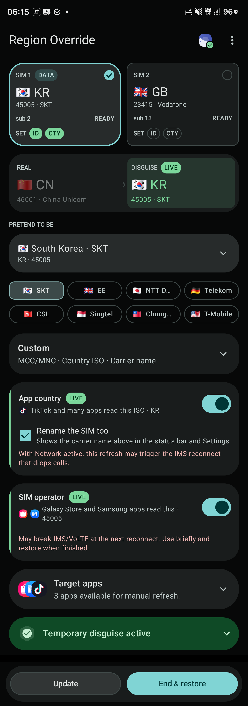
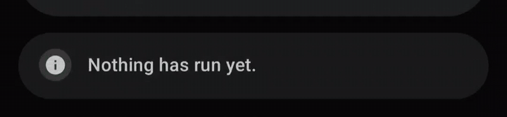
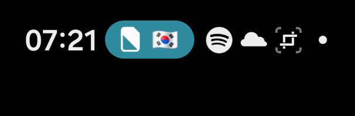
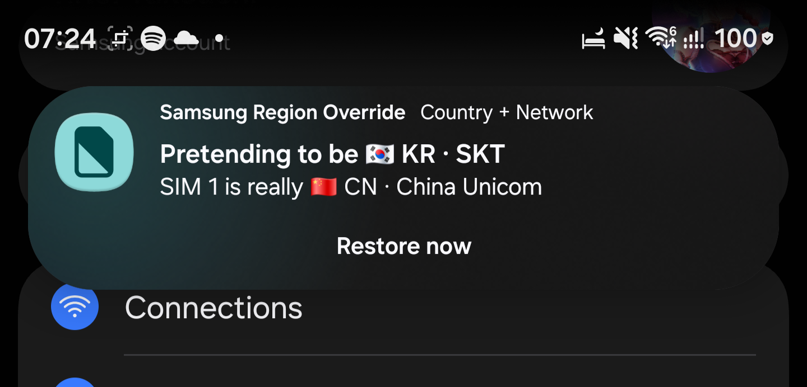

# Samsung Region Override

简体中文 | [English](README.md)

**不用拔卡或换卡，也不必为了切地区先连接 Wi-Fi。Shizuku 运行后，可以在移动数据保持在线的
情况下，临时切换 Galaxy Store、Samsung Members、TikTok 等应用读取到的 SIM 地区；用完一键恢复。**

在已测试的 Galaxy 上，应用和恢复期间移动数据都保持可用。如果系统之后触发 IMS 重连，
“SIM 运营商”层仍可能影响通话或短信，因此建议短时间使用，并在用完后及时恢复。

[下载最新版签名 APK](https://github.com/Ritel-T/SamsungRegionOverride/releases/latest)

> **从 3.x 升级：**4.0 使用新的 Android 包名 `com.ritelt.regionoverride`，会与 3.x 并存，
> 而不是覆盖安装。卸载旧版前，请先在旧版中结束所有伪装。恢复快照、历史选择和 Shizuku
> 授权不会跨包名迁移。

<table>
  <tr>
    <th>准备就绪</th>
    <th>伪装已生效</th>
  </tr>
  <tr>
    <td></td>
    <td></td>
  </tr>
</table>

## 产品特点

- **不用换 SIM。**真实卡、手机号以及与真实运营商的网络连接都保留。
- **不用切到 Wi-Fi。**Shizuku 启动后，所有操作都在本机完成；应用本身没有联网权限，实测手机
  在切换和恢复过程中移动数据保持在线。
- **只改目标应用需要的信号。**“应用国家/地区”和“SIM 运营商”是两层独立开关。
- **随时恢复。**伪装生效后，主按钮自动变成**结束并恢复**，常驻通知也提供**立即恢复**。
- **适合双卡。**界面会明确标记承载移动数据的 SIM，因为大多数目标应用读取的是这一张卡。
- **一键刷新目标应用。**提供方便的一键重启按钮，让目标应用重新读取并应用所选地区；是否清除
  缓存或数据仍由你选择。
- **报错信息可安全分享。**复制、分享和提交问题只使用脱敏摘要，不导出完整 logcat、SIM 标识或
  已安装应用列表。

## Material 3 Expressive 新设计

4.0 的界面已全面重做为 **Material 3 Expressive（MD3E）**：更有表现力的形状与加载动画、按钮
弹性反馈、覆盖整张卡片的触摸效果、更清晰的生效状态、横竖屏自适应布局，以及始终可操作的底部
按钮区。

<p align="center">
  
</p>

结果卡从应用打开时就存在：未运行时显示简洁提示，执行中变成进度界面，结束后折叠为结果摘要。
只有需要排查时，才展开查看技术详情、复制诊断或提交问题。

## 快速使用

1. 从 [Releases](https://github.com/Ritel-T/SamsungRegionOverride/releases/latest) 安装 APK。
2. 启动 Shizuku，并向 Samsung Region Override 授权。
3. 选择承载移动数据的 SIM，再选择目标国家和运营商。
4. 只开启目标应用需要的层。
5. 点击**开始伪装**，等待结果卡执行完毕。
6. 如果目标应用仍显示旧地区，展开**目标应用**，对它点击**强制停止**或**停止并打开**。
7. 使用结束后，回到应用或通知中点击**结束并恢复**。

关闭某一层只会影响下一次应用，**不会清除当前覆盖**；如果该层已经生效，必须点击恢复按钮
才能清除。

## 应该开启哪一层？

| 层 | 常见用途 | 修改内容 | 主要影响 |
|---|---|---|---|
| **应用国家/地区** | TikTok 及读取 SIM 国家 ISO 的应用 | CarrierConfig 国家 ISO；可选修改显示的运营商名称 | 如果假 SIM 运营商已经生效，CarrierConfig 重载可能触发 IMS 重连 |
| **SIM 运营商** | Galaxy Store、Samsung Members 及读取 MCC/MNC 的三星应用 | MCC/MNC、测试 IMSI、SPN 和 PNN | 后续 IMS 重连可能按假运营商注册，从而影响通话或 IMS 短信 |
| **两层一起** | 同时对比两类信号的应用 | 先应用国家/地区，再应用 SIM 运营商 | 覆盖信号更完整，使用后仍建议及时恢复 SIM 运营商层 |

建议先从范围更窄的一层开始。TikTok 一类的国家判断可以先试“应用国家/地区”；Galaxy Store 和
三星应用的运营商判断通常使用“SIM 运营商”。账号地区、IP、CSC、GPS、应用版本、服务端实验和
缓存也可能参与判断，因此实际效果仍会因应用而异。

## 在任何界面恢复

伪装生效时，状态栏会用国旗胶囊持续显示当前地区；展开通知后可以同时看到真实身份和伪装身份，
并在系统设置等任何界面直接恢复。

<p align="center">
  
</p>

<p align="center">
  
</p>

通知权限是可选的。不授予也可以正常应用和恢复，只是不再显示状态提示、常驻提醒和快捷按钮。

## 要求与测试范围

- Android 10（API 29）或更高版本；
- Shizuku 13+，以 shell 或 root 运行并完成授权；本应用不要求 root；
- 手机中有可用的 SIM 或 eSIM；使用“SIM 运营商”层时，所选 SIM 需处于 `READY` 状态；
- 主要面向较新的三星固件，其他三星和非三星系统尚未充分验证。

目前的开发和实机测试主要在 Galaxy S25 Ultra（SM-S938B）上完成，覆盖 Android 16 / One UI 8.5
和 Android 17 / One UI 9 Beta。其他设备、固件和运营商组合可能有不同表现。

## 目标应用

默认列表可以自行修改，初始包含：

| 包名 | 应用 |
|---|---|
| `com.sec.android.app.samsungapps` | Galaxy Store |
| `com.samsung.android.voc` | Samsung Members |
| `com.zhiliaoapp.musically` | TikTok |

开启**之后打开**后，卡片中的快捷按钮可以一键停止并重新打开目标应用。**保留**不清理存储，
**缓存**会请求清除缓存，**数据**则会清除全部本地数据。清除数据会退出账号，并可能删除下载、
草稿和设置。如果固件不支持只清缓存或执行超时，结果卡会显示实际执行情况。

## 通话、IMS 与恢复

“SIM 运营商”修改的是 Android 电话框架中的全局身份，不是只给 Galaxy Store 看的局部值。
已有 IMS 会话可能在应用后暂时正常，但在丢失信号、飞行模式、SIM/UICC 开关、CarrierConfig
刷新或其他重连发生后失败。

参考设备上复现到的过程是：

1. 假 MCC/MNC 生效期间发生 IMS 重连；
2. 三星 IMS 保留真实运营商配置，却用假 MCC/MNC 生成注册域名；
3. 真实网络拒绝这个不匹配的注册；
4. 先恢复真实身份，再安全地切换 UICC，IMS 才恢复。

因此当前版本会先应用“应用国家/地区”、再应用“SIM 运营商”；恢复时先还原 SIM 运营商、再清除
应用国家/地区。只有确认真实运营商已经恢复后，才会在需要时切换 UICC；随后恢复保存的显示名称，
并对尚未确认的 IMS 状态给出提示。应用后的 IMS 观察反映的是当时状态，后续重连仍可能出现变化。

完整过程和框架参考见 [IMS 故障调查](docs/ims-investigation.md)。

## 实现原理

底层实现会尽量让每次修改都留有可靠的恢复路径：

- **SIM 运营商：**运行时解析三星系统中的 `ITelephony.setCarrierTestOverride` 签名，再通过
  shell 身份的 Shizuku UserService 调用；源码不固定 Binder transaction number。
- **应用国家/地区：**短时 instrumentation 以应用包身份运行，只临时采用所需的 shell 电话权限，
  再调用 `CarrierConfigManager.overrideConfig`。Android 17 会先完成 UiAutomation 握手，避开
  One UI 9 中连接尚未结束就退出的竞态。
- **顺序：**两层一起使用时，Country 的异步重载完成后才写 Network；恢复时反向处理，让真实
  运营商先回来，再允许国家配置重载触发重连。
- **恢复状态：**第一次写入前保存真实 MCC/MNC、运营商名、国家 ISO 和订阅显示名称；每次 Binder
  写入前同步记录 pending 状态，即使进程中断，重新打开后仍能继续恢复。
- **SIM 安全：**固件允许时，快照绑定到单向 card 指纹；原始 ICCID 不离开 shell 服务，Android
  重用订阅 id 时也不会把上一张卡的内容误写到新卡。

Compose 界面运行在独立 `:ui` 进程，默认进程只保留一个很小的 Android 17 instrumentation 主机。
CarrierConfig 重载等待有明确上限；如果只完成了一部分，应用仍会保留恢复所需的状态并给出提示。

## 诊断与隐私

结果卡中的完整运行详情只留在设备上。**复制**、**分享**和**提交问题**只使用白名单生成的
`SRO-DIAGNOSTIC/1` 摘要，包括大致设备/运行环境和失败层；不会包含 subscription id、ICCID、
IMSI、IMEI、EID、手机号、card 指纹、ADB 序列号、完整 build fingerprint、应用列表、原始异常
文本、logcat 或 dumpsys。

应用没有 Internet 权限、遥测或账号系统，也不会自动读取或上传全局日志。需要反馈问题时，可参考
[诊断说明](docs/diagnostics.md)。

## 多语言

界面提供英语、简体中文、繁体中文、日语、韩语、法语、德语、西班牙语、巴西葡萄牙语、俄语、
土耳其语、阿拉伯语、印度尼西亚语、泰语和越南语。Android 13 及以上可在系统中单独设置应用语言，
旧版本跟随系统语言。

## 构建与测试

Android 应用包名为 `com.ritelt.regionoverride`。需要 JDK 17 或更高版本，CI 使用 JDK 21。
项目固定使用 Gradle 9.7.1、AGP 9.3.2 / Kotlin 2.2.10，并编译和适配 API 37。

```bash
./gradlew --no-daemon :app:testDebugUnitTest :app:lintDebug :app:assembleDebug :app:assembleDebugAndroidTest
```

调试 APK：

```text
app/build/outputs/apk/debug/app-debug.apk
```

正式签名使用 [发布流程](docs/RELEASING.md) 中的环境变量方案；签名材料和生成的 APK 都不进入
Git。每个 GitHub Release 会同时公布签名 APK、APK SHA-256 和签名证书 SHA-256。

`connectedDebugAndroidTest` 结束时会卸载应用，从而删除恢复所需的快照。存在生效或 pending 的
伪装时，不要在该设备上运行它。

## 已知限制

- 当前界面最多展示两个活动的消费级手机订阅；
- 地区预设是便捷数据，不是实时运营商数据库；
- 部分应用在两层都生效后，仍会使用账号、IP 或旧缓存地区；
- 某些固件无法提供稳定的 card 标识，此时快照无法绑定到已验证的卡身份；如果之后检测结果发生
  变化，界面会提示适合的处理方式；
- 本工具修改的是本机测试覆盖，不会提供运营商权益、付费内容或网络接入。

请只在自己控制的设备和账号上使用，并遵守目标服务条款及当地法律。本项目与 Samsung、Galaxy
Store、Samsung Members、TikTok/ByteDance、Google 和 Shizuku 均无隶属、合作或背书关系。

## 许可证

[MIT](LICENSE)。内置 Shizuku 库继续使用 Apache-2.0 许可证，详见
[第三方许可说明](THIRD_PARTY_NOTICES.md)。
